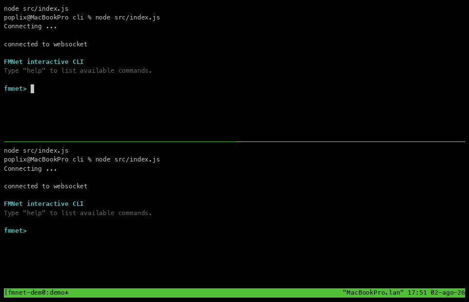

# SEPT / FMNet

> Private communication and trusted-device networking.

SEPT is a privacy-first protocol and JavaScript SDK for secure communication between trusted devices through a **content-blind relay**. The relay forwards encrypted events and coordinates connectivity, but it does not hold device keys or participate in the network authorization model.

The default relay runs on Cloudflare Workers. You can use the public development relay or deploy your own relay to your Cloudflare account by running `wrangler deploy`.

SEPT was originally created as the foundation for **FMNet**, an application that combines:

- private messaging
- application-defined remote actions
- TCP tunnelling over WebRTC
- peer-to-peer WebRTC data channels

Devices are added to a SEPT network by the network's admin through an explicit
pairing process. They can send or receive only the event types for which they have been granted the required capabilities.

Capabilities are distributed as signed events and stored locally by each device, allowing authorization decisions to remain independent from the relay.


---

## See it in action



In a few commands, one trusted device can message another, request an application-defined action, and open a TCP tunnel to a private service:

```text
message send apu "hello there"
run-action apu door-open
tunnel open apu 127.0.0.1 22 2222
ssh -p 2222 127.0.0.1
```

---

## Quick start

The current demo uses the public FMNet relay by default, so no relay infrastructure is required for initial testing.

### Installation

```bash
./install.sh cli
```

### Run

```bash
./run.sh
```

You need two terminals or two machines:

- **Device A** creates the network.
- **Device B** joins it and becomes a trusted peer after explicit confirmation.

```
$ ./run.sh

Insert your name: DeviceB

What do you want to do?
1. Create a new network
2. Join a network

Select option:
```


### 1. Pair Device B

On Device A (the admin that created the network):

```text
fmnet> device add <b64-client-data>
```

The CLI displays a pairing PIN. Enter that PIN on Device B to confirm the pairing.


### 2. Grant capabilities

SEPT uses a default-deny authorization model. A paired device cannot automatically open data channels, create tunnels, or invoke arbitrary actions.

Allow DeviceB to open TCP tunnels on DeviceA:

```
fmnet> device grant-tunnel DeviceB DeviceA
```

Allow DeviceB to send messages to DeviceA:
```
fmnet> device grant DeviceB DeviceA message
```

For a custom action, grant the corresponding application-defined capability as well:

```text
fmnet> device grant DeviceA DeviceB customaction.response
fmnet> device grant DeviceB DeviceA customaction.door-open
```

### 3. List available fmnet commands:

```
fmnet> help
```

## TCP Tunnels

### Quick Example
Expose SSH on Device B as local port `2222` on Device A:

```
fmnet> tunnel open DeviceB 127.0.0.1 22 2222
```

```text
Device A                          Device B
127.0.0.1:2222                    127.0.0.1:22
       │                                ▲
       └──── TCP over WebRTC tunnel ────┘
```

Connect through the tunnel:

```bash
ssh -p 2222 <username>@127.0.0.1
```

---

### How connections and tunnels work

FMNet maintains a reusable WebRTC connection to each peer when needed. Opening the first tunnel to a device establishes that connection; later tunnels can reuse it.

Closing one tunnel does not implicitly close the shared device connection.

```text
Device connection / DataChannelManager
├── TCP tunnel #1
│   ├── TCP socket #1 / DataChannel
│   └── TCP socket #2 / DataChannel
├── TCP tunnel #2
│   └── TCP socket #1 / DataChannel
└── application DataChannels
```

Each TCP socket gets its own WebRTC DataChannel. Multiple SSH shells, file transfers, and other TCP sessions can therefore run concurrently while sharing the underlying peer connection.

The persistent connection can be closed explicitly when it is no longer needed.

---

## Why plain JavaScript?

SEPT is written in **plain JavaScript** to maximize compatibility across runtimes and platforms.

The same core libraries are designed to run across:

- Node.js;
- browsers;
- React Native and Expo;
- Cloudflare Workers.

JavaScript was chosen deliberately, not as a shortcut. Portability is a core project requirement, and avoiding unnecessary build complexity makes the protocol easier to embed in applications, servers, browsers, and small devices.

---

## Public relay and self-hosting

### Default public relay

The CLI currently uses the public FMNet relay by default.

This lets contributors and testers run the demo without deploying server-side infrastructure. The public relay should be considered suitable for development and testing while the project is under active development.

### Deploy your own relay

The relay runs on Cloudflare Workers and can be deployed to your own Cloudflare account:

```bash
wrangler deploy
```

After deployment, configure the client to use your relay endpoint instead of the default public relay.

> A complete self-hosting guide will document the required Cloudflare resources, bindings, migrations, storage configuration, secrets, and client endpoint configuration.

---

## Current status

The current implementation has been tested with:

- messaging between paired devices;
- application-defined custom actions;
- multiple concurrent SSH sessions;
- large SCP transfers;
- multiple TCP sockets over one reusable WebRTC peer connection;
- remote deployment;

Performance optimization, documentation, packaging, and broader compatibility testing are ongoing.

---

## Security notice

SEPT and FMNet are under active development and have not yet received an independent security audit.

Do not rely on the current implementation for high-risk or production-critical environments without reviewing the code, deployment model, cryptographic design, authorization policy, and relay configuration.

---

## Roadmap

- stabilize and document the CLI;
- complete the FMNet mobile application;
- document the protocol, cryptography, and authorization flows;
- improve TCP tunnel throughput and flow control;

---

## Contributing

The project is still evolving rapidly.

Bug reports, architecture feedback, platform compatibility reports, and real-world test results are welcome.

Before opening a pull request, please open an issue describing the proposed change and its intended use case.

---

## License

MIT
