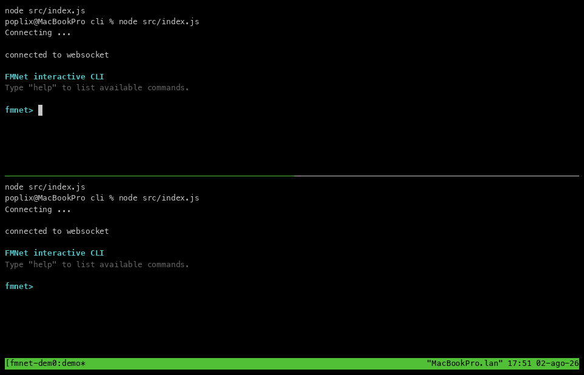

# FMNet

FMNet is an application built on [SEPT](https://github.com/fcavallarin/sept).

It adds application-level features on top of SEPT, including:

- TCP tunnelling over WebRTC
- private messaging
- application-defined remote actions
- peer-to-peer WebRTC data channels

SEPT itself is maintained in a separate repository. Device identity, pairing primitives, encrypted event delivery, distributed ACLs, relay behavior and the SEPT JavaScript API are documented in the [SEPT repository](https://github.com/fcavallarin/sept).

## See FMNet in action




## Quick start

The easiest way to try FMNet is with two CLI instances, representing two devices.

### Install

```bash
npm install
```

### Start the first device

Run FMNet:

```bash
npm run fmnet:cli
```

On first launch, choose a device name and create a new network.

For example:

```text
Insert your name: DeviceA

What do you want to do?
1. Create a new network
2. Join a network

Select option: 1
```

Device A is now the first administrator of the new network.

### Start the second device

In another terminal or on another machine:

```bash
npm run fmnet:cli
```

Choose another device name and select **Join a network**:

```text
Insert your name: DeviceB

What do you want to do?
1. Create a new network
2. Join a network

Select option: 2
```

The new device displays its pairing data as a base64-encoded string.

### Pair Device B

On Device A, add the new device using the pairing data shown by Device B:

```text
fmnet> device add <b64-client-data>
```

Device A returns a short-lived PIN.

Enter that PIN on Device B to complete the pairing.

Pairing establishes the device relationship, but it does not automatically grant arbitrary FMNet capabilities.

### Grant capabilities

FMNet uses SEPT's default-deny authorization model.

For example, to allow Device B to send messages to Device A:

```text
fmnet> device grant DeviceB DeviceA message
```

To allow Device B to open TCP tunnels on Device A:

```text
fmnet> device grant-tunnel DeviceB DeviceA
```

Application-defined actions use their own event types. For example:

```text
fmnet> device grant DeviceB DeviceA customaction.door-open
fmnet> device grant DeviceA DeviceB customaction.response
```

### Send a message

Once the corresponding capability has been granted:

```text
fmnet> message send DeviceA "hello there"
```

### Run an action

For an application-defined action:

```text
fmnet> run-action DeviceA door-open
```

### Open a TCP tunnel

Expose a TCP service reachable from Device B as a local port on Device A:

```text
fmnet> tunnel open DeviceB 127.0.0.1 22 2222
```

This maps:

```text
Device A                          Device B
127.0.0.1:2222                    127.0.0.1:22
       │                                ▲
       └──── TCP over WebRTC tunnel ────┘
```

You can then use the local endpoint normally:

```bash
ssh -p 2222 <username>@127.0.0.1
```

Run:

```text
fmnet> help
```

to see the commands supported by the current CLI.

## How FMNet uses SEPT

FMNet deliberately does not reimplement the concerns handled by SEPT.

SEPT provides the underlying:

- device identity;
- network membership and pairing;
- end-to-end encrypted events;
- authorization and distributed ACLs;
- offline event delivery;
- relay synchronization.

FMNet assigns application meaning to those events and adds direct peer-to-peer communication where appropriate.

```text
┌──────────────────────┐                         ┌──────────────────────┐
│       Device A       │                         │       Device B       │
│                      │                         │                      │
│        FMNet         │                         │        FMNet         │
│          │           │                         │          │           │
│        SEPT          │                         │        SEPT          │
└──────────┬───────────┘                         └──────────┬───────────┘
           │                                                │
           └──────── encrypted events / signalling ─────────┘
                            via SEPT

           ┌────────────────────────────────────────────────┐
           │              WebRTC peer connection            │
           │  application DataChannels / TCP tunnel traffic │
           └────────────────────────────────────────────────┘
```

The SEPT protocol, SDK API, authorization rules and security model are intentionally not duplicated here.

## Messaging

Messaging is an FMNet application feature implemented using SEPT events.

A device must be explicitly authorized to send the corresponding event type to another device.

```text
fmnet> message send DeviceA "hello there"
```

SEPT handles transport, authentication, encryption, authorization and offline delivery. FMNet defines the message semantics and user-facing command.

## Remote actions

FMNet supports application-defined remote actions.

For example:

```text
fmnet> run-action DeviceA door-open
```

The action itself is application-specific. Authorization is expressed using SEPT event types, allowing each action to be granted independently.

For example:

```text
customaction.door-open
customaction.response
```

This makes it possible to expose a small set of actions without granting a device broader access.

## WebRTC and TCP tunnels

FMNet can establish a reusable WebRTC peer connection between two devices.

The peer connection can carry multiple independent DataChannels:

```text
Device connection
├── application DataChannel
├── TCP tunnel #1
│   ├── TCP socket #1 / DataChannel
│   └── TCP socket #2 / DataChannel
└── TCP tunnel #2
    └── TCP socket #1 / DataChannel
```

Each TCP socket uses its own DataChannel, while multiple sockets can share the same underlying peer connection.

This allows normal TCP applications such as SSH or SCP to communicate with services on another FMNet device without exposing those services publicly.

## Repository scope

This repository contains FMNet.

The old top-level `packages/` directory contained the SEPT implementation and is being removed now that SEPT lives in its own repository.

Documentation specific to the SEPT protocol, SDK, relay, authorization model and security model belongs in:

https://github.com/fcavallarin/sept

FMNet documentation should cover only the application built on top of it.

## Project status

FMNet is under active development.

The project is currently useful for experimenting with:

- encrypted device-to-device messaging;
- explicitly authorized remote actions;
- private service access;
- WebRTC data channels;
- TCP and SSH tunnelling.

The underlying SEPT protocol and implementation have not received an independent security audit. See the SEPT repository for its current security documentation and limitations.

## License

MIT
