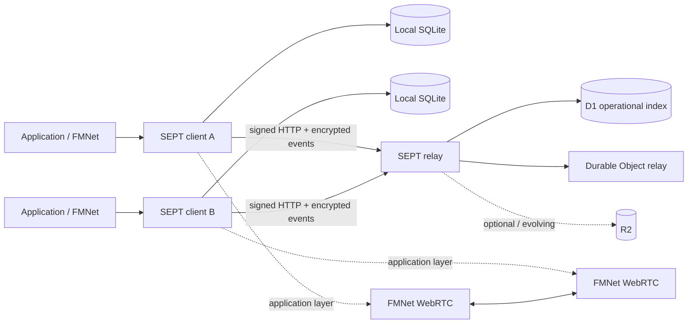
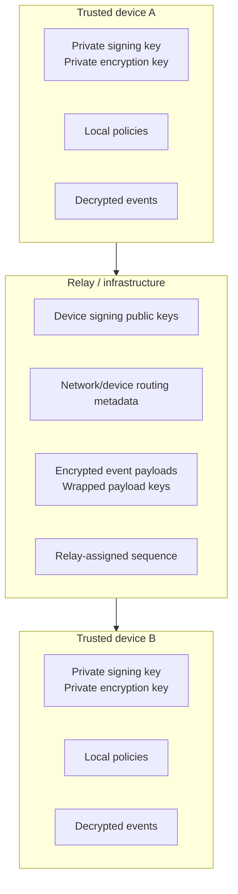
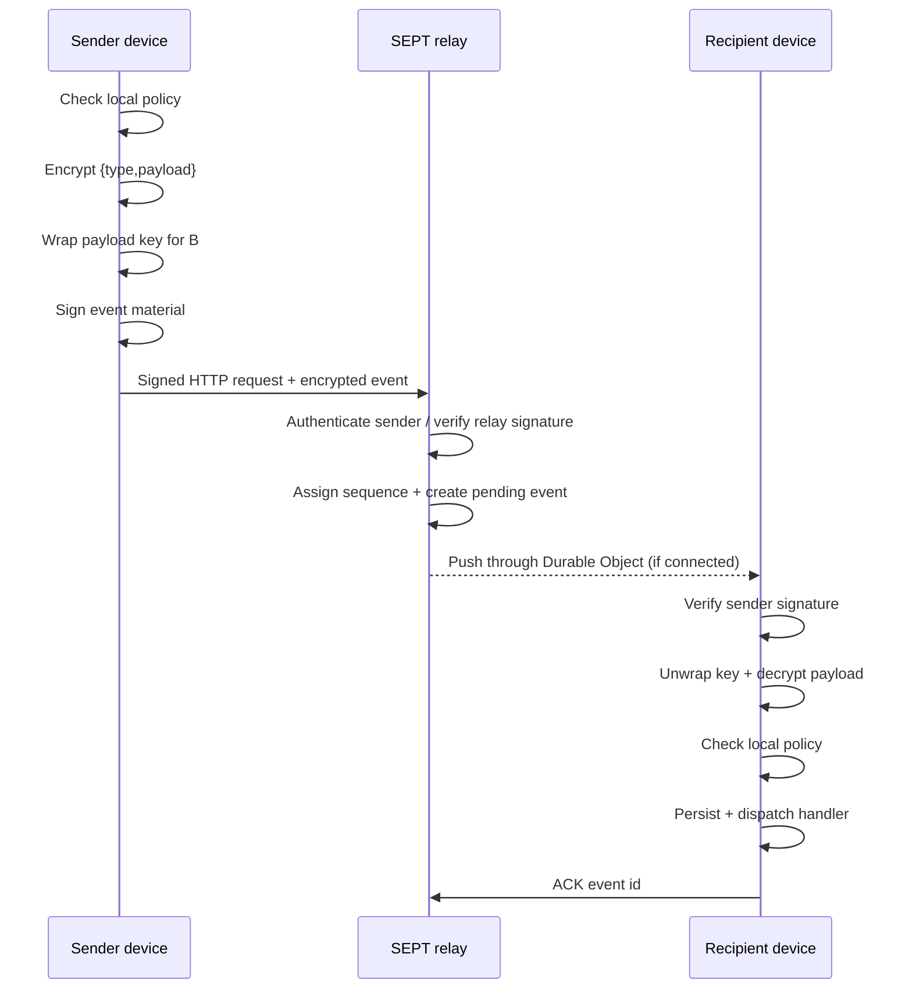
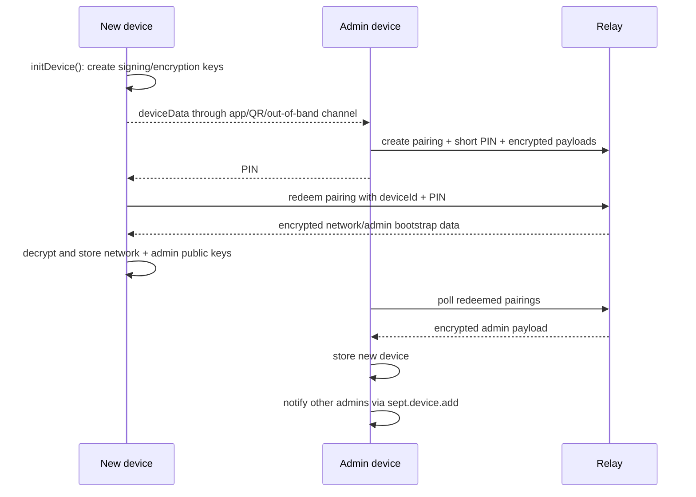

# Architecture

SEPT separates **device trust and application authorization** from the relay used to transport events.

The current JavaScript implementation is intentionally pragmatic: protocol logic, persistence and runtime orchestration live together in `@sept/client`. The project does not currently claim a formal `proto`/`sdk` package boundary; that boundary is expected to become clearer through interoperability and future ports.

## Components

### `@sept/client`

The client currently owns:

- device key generation and local identity;
- network bootstrap and pairing;
- event encryption, signing, verification and decryption;
- directed authorization policies;
- admin/device lifecycle;
- local SQLite-backed state;
- REST synchronization;
- WebSocket connection/reconnection;
- application event registration and dispatch;
- a small namespaced application KV store.

### `@sept/core`

Cross-runtime primitives:

- canonical JSON;
- binary/base64url serialization;
- deterministic IDs;
- generic utilities;
- request helpers;
- SQL adapters;
- event bus;
- async queue.

### `@sept/crypto`

Cryptographic primitives used by client/server:

- Ed25519 signing and verification;
- X25519 key agreement;
- HKDF-SHA256 key derivation;
- XChaCha20-Poly1305 authenticated encryption;
- SHA-256 hashing;
- secure random values.

### `@sept/server`

The server package provides the reference relay implementation:

- bootstrap registration;
- signed request authentication for established devices;
- pairing coordination;
- encrypted event acceptance and pending-recipient storage;
- relay-side event sequencing;
- ACK processing;
- WebSocket ticketing and Durable Object push delivery;
- a plugin surface for custom routes and server-side event notifications.

### `apps/worker`

Cloudflare deployment composition around `@sept/server`. It wires D1, Durable Objects and other Cloudflare bindings and currently demonstrates an FMNet push-notification plugin.

### FMNet

FMNet is intentionally above SEPT. It uses typed SEPT events to coordinate application behavior, including messaging and WebRTC setup. TCP tunnels and application DataChannels do not change the SEPT trust model; they are application features authorized/negotiated through SEPT events.

## Trust boundaries

The relay is intentionally **not the source of truth for application authorization**. A recipient evaluates the sender's locally stored policy after verifying/decrypting an event.

The relay is still trusted for availability, transport routing, pending-event delivery and relay-assigned ordering. It also participates in initial pairing trust bootstrap before a new device has a trusted admin key. These are distinct from content confidentiality and application authorization; see [Security](security.md).

## Event flow

Offline recipients obtain the same pending events through `sync()`.

## Pairing flow

Pairing is the mechanism that introduces a new device and its public keys into a network.

Only the admin device that initiated a pairing can retrieve/consume its admin-side completion payload. The relay stores opaque encrypted pairing payloads, but the new device necessarily relies on the relay during this initial bootstrap because it has no existing trust anchor yet.

## Persistence model

The client uses local SQLite-backed stores for:

- settings and local private-key material (with a configurable secret-key provider where used);
- network identity;
- device public keys/roles/revocation state;
- directed graph edges and policies;
- incoming/outgoing events and recipients;
- application KV state.

This local state is what lets authorization remain available without asking the relay for permission on every application event.

The relay uses D1 as an operational index for networks, devices, pending events, pairings and event sequence state. A pending event is removed for a device when that device ACKs it; the encrypted event row can be removed once no pending recipients remain.

## Runtime boundaries vs protocol boundaries

The repository currently favors working cross-runtime code over a prematurely formalized package taxonomy. For example, SQLite persistence is part of the current client implementation even though a future Go implementation may choose a simpler storage surface.

A useful rule when interpreting the code is:

- **wire/protocol behavior:** key material, canonicalization, signing/encryption, pairing semantics, event verification, system events and authorization semantics;
- **runtime/SDK behavior:** SQLite query helpers, event filtering ergonomics, namespaced KV storage, REST/WebSocket lifecycle and platform adapters;
- **application behavior:** FMNet messages, custom actions, WebRTC sessions and TCP tunnels.

The exact `protocol` vs `SDK` package split is intentionally not frozen yet.
